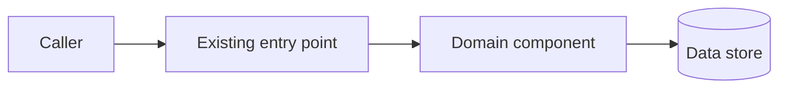
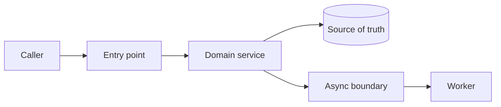
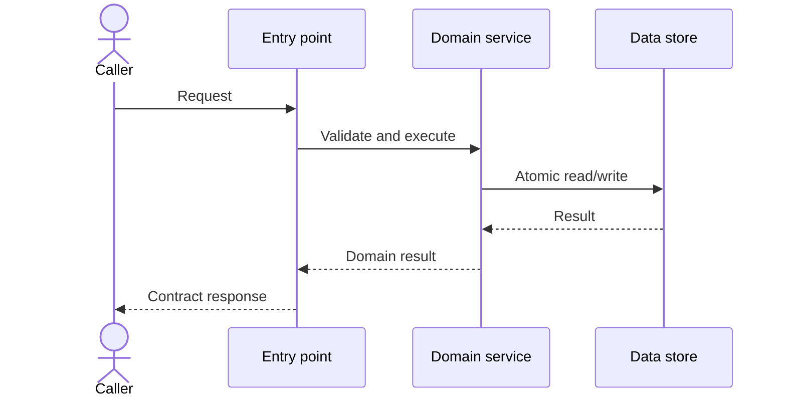

# TDD: [Feature or system name]

> This document is the authority for **how the approved product requirements will be implemented and verified**. The PRD remains authoritative for product behavior. A TDD may clarify but must not silently change a PRD requirement.

## Authoring rules

Delete this section when the TDD is approved.

- Inspect the target repository before completing this document. Cite real paths, symbols, commands, conventions, and dependency versions.
- Replace every bracketed prompt and delete sections that do not apply.
- Use stable IDs and preserve PRD IDs exactly.
- Distinguish observed repository facts from proposals and assumptions.
- Make the selected design complete enough that an implementation agent need not invent architecture.
- Prefer exact contracts, invariants, state transitions, and failure behavior over narrative description.
- Use `None` when a category is applicable but has no entries. Use `Unknown — TQ-[ID]` when unresolved; never fabricate repository facts or technical values.
- Keep details canonical: flows and interfaces reference FAIL/OBS/TEST IDs instead of repeating failure, telemetry, or verification definitions; §13 owns delivery order; §15.3 owns exact verification commands.
- Put task-level sequencing in the implementation plan; do not reproduce an entire issue tracker.
- Mark unresolved implementation-blocking questions as `BLOCKER`. No blockers may remain at handoff.

## 0. Implementation handoff summary — Required

This is the minimum context an implementation agent should read first.

| Field | Answer |
|---|---|
| Objective | [One sentence describing the technical outcome] |
| Selected approach | [One paragraph or less] |
| Repository/workspace | [Exact repository and working directory] |
| Primary change surface | [Services, packages, apps, modules, or file paths] |
| Interfaces changed | [APIs, events, schemas, commands, UI contracts, or None] |
| Data changes | [Schema, migration, backfill, retention, or None] |
| New dependencies | [Libraries, services, infrastructure, or None] |
| Delivery mechanism | [Flag, staged rollout, migration sequence, or direct release] |
| Verification | [TEST/CMD-IDs from §15] |
| Irreversible actions | [Data deletion, one-way migration, external side effect, or None] |
| Blockers | [None, or TQ-IDs marked BLOCKER] |

### 0.1 Applicability profile — Required

Mark every area before writing the design. Complete conditional sections only when triggered; record the reason when a seemingly relevant area is not applicable.

| Area | Applies? | Trigger/rationale | Required section |
|---|---|---|---|
| Public or cross-component contract | Yes / No | [Reason] | §6 |
| Persisted data or migration | Yes / No | [Reason] | §7 |
| Stateful, concurrent, or asynchronous behavior | Yes / No | [Reason] | §8 |
| Security/privacy/abuse-sensitive surface | Yes / No | [Reason] | §10 |
| Material capacity, reliability, or cost impact | Yes / No | [Reason] | §11 |
| Operational signals or ownership change | Yes / No | [Reason] | §12 |
| Staged rollout or compatibility sequence | Yes / No | [Reason] | §13 |
| Parallel implementation workstreams | Yes / No | [Reason] | §14.3 |
| Consequential alternative/design tradeoff | Yes / No | [Reason] | §16 |

## 1. Authority, conflict, and agent execution rules — Required

### 1.1 Source of truth

| Concern | Authority |
|---|---|
| Product intent and observable behavior | Approved PRD |
| Technical approach and component contracts | Approved TDD |
| Existing structure and local conventions | Repository code and repository instructions |
| Task-level assignment/completion status only | `task_status_authority` named in frontmatter |

The TDD controls scope and sequence. The named task-status authority cannot add scope or override approved PRD/TDD content.

Before editing, compare `related_prd_revision` and `repository_revision` with the supplied inputs. Continue through unrelated drift. Record and stop when drift changes a cited path/symbol, contract, requirement, migration assumption, or makes an implementation step unverifiable.

If authoritative sources conflict, record the discrepancy and stop only when it affects a P0/P1 behavior, public contract, data safety, security, or an irreversible action. Minor non-blocking discrepancies may use the documented default and must be reported.

### 1.2 Execution boundaries

- **In scope:** [Repositories, packages, services, surfaces, and artifacts the agent may change]
- **Out of scope:** [Systems or refactors the agent must not change]
- **Allowed incidental work:** [Tests, generated files, small refactors, documentation, or None]
- **Must preserve:** [Backward compatibility, unrelated user changes, public behavior, formatting, or other invariants]

### 1.3 Approval points

| ID | Action | Authorized approver | Approval evidence/link | Must be obtained before |
|---|---|---|---|---|
| AP-01 | [New infrastructure, dependency, public API change, destructive migration, external side effect, or other sensitive action] | [Role/name] | [Link, or Pending] | STEP-XX |

Use `None` explicitly when no approval points exist. The implementation agent MUST stop before an approval-point or irreversible action whose evidence is missing or `Pending`.

### 1.4 Execution outcomes

- Continue for behavior-preserving local adaptations that follow repository conventions, or for a documented non-blocking default.
- Stop before a deviation affecting scope, P0/P1 behavior, a public contract, a data/security boundary, a new dependency, destructive/irreversible work, or required verification.
- A known unrelated pre-existing failure may be bypassed only with reproducible baseline evidence; record the command and matching before/after failure. Otherwise, do not mark implementation complete.
- If a required command cannot run or a step becomes infeasible, record why and stop unless an approved equivalent verification or design deviation already exists.

## 2. Context and repository baseline — Required

### 2.1 Problem and design context

[Summarize the approved PRD problem and the technical reason a change is needed. Link to relevant incidents, ADRs, designs, or issues.]

### 2.2 Current implementation

Describe only the relevant current path through the system.

| Area | Current component/path/symbol | Responsibility | Limitation |
|---|---|---|---|
| [Area] | `[exact/path]` — `[symbol]` | [Current role] | [Why it must change] |

### 2.3 Repository instructions and conventions

| Concern | Observed convention or command | Source |
|---|---|---|
| Agent instructions | [Applicable CLAUDE.md or equivalent] | `[path]` |
| Language/runtime | [Language and exact version] | `[manifest/config path]` |
| Package/build system | [Tool and workspace layout] | `[path]` |
| Architecture pattern | [Observed pattern] | `[representative path]` |
| Tests | [Framework, placement, naming] | `[path]` |
| Lint/format/type-check | [Exact commands] | `[config path]` |
| Migrations/code generation | [Tool and command] | `[path]` |

### 2.4 Current architecture

[Optional: provide a compact diagram only when it communicates a relationship not already clear from the component table. The prose and contracts remain canonical.]



## 3. Requirements and design goals — Required

### 3.1 PRD traceability

Every P0 and non-deferred P1 FR/NFR, plus all linked BR/AUTH/LIFE/DATA-POL/IX/DEP/EVT/GR obligations, must appear here. Include a P2 item only when it is explicitly in the implementation scope. If an item requires no code change, say why. Record each P1 deferral by its approved PRD PD-ID.

| PRD ID(s) | Requirement/obligation summary | Technical response | Design sections | Verification IDs |
|---|---|---|---|---|
| FR-01 | [Behavior] | [Mechanism or “No change—already satisfied”] | §[X] | TEST-01 |
| NFR-01, DATA-POL-01 | [Quality target/policy] | [Mechanism] | §[X] | TEST-02 / OBS-01 |

### 3.2 Technical goals

| ID | Goal | Evidence of completion |
|---|---|---|
| TG-01 | [Technical outcome] | [Test, metric, artifact, or observed state] |

### 3.3 Technical non-goals

| ID | Non-goal | Reason |
|---|---|---|
| TNG-01 | [Refactor, platform, optimization, or behavior not addressed] | [Why excluded] |

## 4. Selected design — Required

### 4.1 Design overview

[Explain the end-to-end approach, component boundaries, ownership, and why this is the smallest coherent design that meets the PRD.]

### 4.2 Key decisions

| ID | Decision | Rationale | Consequences |
|---|---|---|---|
| TD-01 | [Specific technical choice] | [Why it best fits the constraints] | [Tradeoffs and follow-up obligations] |

### 4.3 Proposed architecture

[Optional: include only when the diagram conveys relationships or boundaries not already clear from §4.4.]



### 4.4 Component responsibilities

| ID | Component | Responsibility | Owns state? | Change | Owner |
|---|---|---|---|---|---|
| CMP-01 | [Name and exact path] | [What it owns and explicitly does not own] | Yes / No | Create / Modify / Reuse | [Team] |

### 4.5 Invariants

| ID | Invariant | Enforcement point | Failure response |
|---|---|---|---|
| INV-01 | [Condition that must always remain true] | [Component/constraint] | [Reject, roll back, repair, alert] |

## 5. Detailed flows — Required

### FLOW-01 — [Primary flow]

- **Initiator:** [Actor/component]
- **Preconditions:** [State and dependencies]
- **Transaction/consistency boundary:** [Exact boundary]
- **Steps:**
  1. [Component and operation]
  2. [Validation/authorization]
  3. [State change or side effect]
  4. [Response/event]
- **Postconditions:** [Guaranteed state]
- **Idempotency:** [Key, scope, lifetime, and repeated-call behavior]
- **Observability:** [Logs, metrics, traces, or audit events emitted]
- **Failure paths:** [FAIL-IDs]



Duplicate this section for each materially different synchronous, asynchronous, migration, or recovery flow.

## 6. Contracts and interfaces — Required when changed

Contracts are normative. Include exact types and semantics; use links to checked-in schemas when they are canonical.

### 6.1 Contract inventory

| ID | Type | Name | Producer/owner | Consumers | Compatibility |
|---|---|---|---|---|---|
| API-01 | HTTP / RPC / event / CLI / internal | [Stable name] | [Owner] | [Consumers] | New / Compatible / Breaking |

### 6.2 API-01 — [Contract name]

- **Endpoint/topic/signature:** `[exact contract]`
- **Purpose:** [Single responsibility]
- **Authentication:** [Mechanism or N/A]
- **Authorization:** [Policy and enforcement point or N/A]
- **Request/input:**

```json
{
  "example": "value"
}
```

- **Validation:** [Required fields, bounds, normalization, unknown-field behavior]
- **Success/output:**

```json
{
  "id": "example-id",
  "status": "example-status"
}
```

- **Errors:**

| Condition | Code/type | Retryable? | Caller behavior |
|---|---|---|---|
| [Condition] | [Exact code/type] | Yes / No | [Action] |

- **Timeout/retry semantics:** [Budgets, backoff, ownership]
- **Idempotency/ordering:** [Guarantees and keys]
- **Pagination/rate limits:** [Contract or N/A]
- **Versioning:** [Evolution and deprecation strategy]

### 6.3 Compatibility matrix

| Producer version | Consumer version | Supported? | Behavior or mitigation |
|---|---|---|---|
| Old | New | Yes / No | [Behavior] |
| New | Old | Yes / No | [Behavior] |

## 7. Data design and migration — Required when data is involved

### 7.1 Ownership and consistency

- **Source of truth:** [System/component]
- **Write owner:** [Component]
- **Readers:** [Components]
- **Consistency model:** [Strong/eventual and acceptable convergence time]
- **Transaction boundary:** [Operations covered atomically]
- **Read path:** [Primary/replica/cache selection and staleness policy]
- **Cache behavior:** [Keys, TTL, invalidation, or None]
- **Data classification:** [Public/Internal/Confidential/Restricted]
- **Retention/deletion:** [Rules and enforcement]

### 7.2 Schema changes

| ID | Store/object | Change | Constraints/indexes | Compatibility |
|---|---|---|---|---|
| DATA-01 | [Table/document/cache/topic] | [Exact fields/types/defaults] | [Keys and indexes] | [Old/new reader behavior] |

```sql
-- Illustrative or exact migration. Label which it is.
ALTER TABLE example
    ADD COLUMN example_status TEXT;
```

### 7.3 Migration and backfill

| Phase | Operation | Safe to retry? | Validation | Rollback/repair |
|---|---|---|---|---|
| Expand | [Backward-compatible schema or code] | Yes / No | [Check] | [Action] |
| Migrate | [Backfill or dual-write] | Yes / No | [Counts/checksum/query] | [Action] |
| Contract | [Cleanup/removal] | Yes / No | [Check] | [Action] |

Specify batch size, throttling, checkpointing, expected duration, load impact, invalid-record handling, and ownership when applicable.

## 8. State, concurrency, and asynchronous behavior — If applicable

### 8.1 State model

| From | Event/condition | To | Side effects | Invalid transition behavior |
|---|---|---|---|---|
| [State] | [Event/guard] | [State] | [Effects] | [Reject/no-op/repair] |

For time-dependent state, specify the authoritative clock, exact boundary predicate, precision/timezone, accepted skew, deterministic test-clock strategy, and cleanup/retention behavior.

### 8.2 Concurrency

[Specify each material race and the exact enforcement mechanism: transaction isolation, lock, conditional write, uniqueness constraint, compare-and-swap, or other primitive. Define the winning outcome, conflict response, retry owner, and acceptable inconsistency window.]

### 8.3 Asynchronous delivery

| Concern | Guarantee |
|---|---|
| Delivery | At-most-once / At-least-once / Effectively-once |
| Ordering | [Scope of ordering or None] |
| Deduplication | [Key and retention] |
| Retry | [Attempts, backoff, jitter, retryable errors] |
| Poison messages | [Dead letter/quarantine/alert behavior] |
| Reconciliation | [Detection and repair process] |
| Backpressure | [Queue/backlog/load-shedding behavior] |

## 9. Failure modes and recovery — Required

| ID | Failure | Detection | Immediate behavior | User/caller impact | Recovery | Alert? |
|---|---|---|---|---|---|---|
| FAIL-01 | [Timeout, partial write, crash, bad data, overload, or dependency loss] | [Signal] | [Retry/degrade/reject/roll back] | [Observable result] | [Automatic/manual action] | [Condition] |

Explicitly address applicable partial failures, retry exhaustion, duplicate work, invalid data, resource exhaustion, dependency outages, and recovery after process restart.

## 10. Security, privacy, and abuse resistance — Required

### 10.1 Trust boundaries and threats

| ID | Asset/entry point | Threat or misuse | Control | Residual risk | Verification |
|---|---|---|---|---|---|
| SEC-01 | [Asset/boundary] | [Threat] | [Mitigation] | [Remaining exposure] | [Test/review] |

### 10.2 Required controls

- **Authentication:** [Identity mechanism and failure behavior]
- **Authorization:** [Policy, tenant boundary, and enforcement point]
- **Input/output safety:** [Validation, encoding, injection controls, sensitive output]
- **Secrets:** [Storage, access, and rotation]
- **Bearer credentials or sensitive links:** [Generation/entropy, encoding, transport, persisted representation, lookup/comparison, one-time exposure, redaction, rotation, and compromise response—or None]
- **Encryption:** [In transit/at rest and key ownership]
- **Audit:** [Events, actor identity, integrity, retention]
- **Privacy:** [Minimization, consent, residency, access, deletion]
- **Abuse controls:** [Rate limits, quotas, anomaly detection, manual controls]

## 11. Performance, capacity, reliability, and cost — Required

### 11.1 Workload assumptions

| Dimension | Current | Launch | Forecast | Peak/worst case | Source/confidence |
|---|---:|---:|---:|---:|---|
| Requests/events per second | [Value] | [Value] | [Value] | [Value] | [Source; L/M/H] |
| Data size/growth | [Value] | [Value] | [Value] | [Value] | [Source; L/M/H] |
| Concurrent work | [Value] | [Value] | [Value] | [Value] | [Source; L/M/H] |

### 11.2 Budgets and bottlenecks

| ID | Budget/limit | Allocation or analysis | Safety margin | Validation |
|---|---|---|---|---|
| PERF-01 | [Latency/throughput/memory/storage target] | [Calculation] | [Margin] | [Benchmark/load test] |
| COST-01 | [Unit/total cost ceiling] | [Estimate] | [Margin] | [Measurement] |

[Identify the expected bottleneck, overload behavior, caching policy, scaling trigger, and degradation strategy.]

## 12. Observability and operations — Required

### 12.1 Signals

| ID | Signal | Exact name/fields | Purpose | Threshold or query |
|---|---|---|---|---|
| OBS-01 | Metric / log / trace / audit | [Name and dimensions] | [What it proves or diagnoses] | [Threshold/query] |

Avoid high-cardinality or sensitive dimensions. State sampling and retention when relevant.

### 12.2 Operational ownership

| Artifact/responsibility | Location or owner |
|---|---|
| Dashboard | [Link/path] |
| Alerts | [Link/path] |
| Runbook | [Link/path] |
| On-call owner | [Team] |
| Escalation | [Path] |
| SLI/SLO | [Definition and target] |

## 13. Delivery, compatibility, and rollback — Required

### 13.1 Deployment order

| Order | Deploy/change | Prerequisite | Validation gate | Safe state if stopped here |
|---:|---|---|---|---|
| 1 | [Backward-compatible preparation] | [None/dependency] | [Check] | [System behavior] |

### 13.2 Rollout stages

| Stage | Exposure | Entry criteria | Checks | Promote criteria | Pause/rollback criteria |
|---|---|---|---|---|---|
| Internal | [Users/traffic] | [Criteria] | [Tests/OBS-IDs] | [Criteria] | [Criteria] |
| Canary | [Percentage/cohort] | [Criteria] | [Tests/OBS-IDs] | [Criteria] | [Criteria] |
| General | [Scope] | [Criteria] | [Tests/OBS-IDs] | [Criteria] | [Criteria] |

### 13.3 Rollback and forward repair

- **Disable mechanism:** [Flag/config/deploy action]
- **Code rollback:** [Exact procedure and compatibility constraints]
- **Data rollback:** [Procedure, or explain why impossible]
- **Forward repair:** [How to restore correctness if rollback is unsafe]
- **Irreversible point:** [Exact step, authorization required, or None]
- **Post-rollback validation:** [Queries, metrics, and tests]

## 14. Implementation plan — Required

The plan must be dependency-ordered and specific enough for an agent to execute without rediscovering the design. Prefer narrow, independently verifiable steps. Paths may be directory or glob patterns only when exact new filenames are intentionally delegated.

### 14.1 Change inventory

| Change | Path/module | Symbols or objects | Purpose | PRD/TDD IDs |
|---|---|---|---|---|
| Create / Modify / Delete | `[exact path]` | `[symbol/schema/route]` | [Change] | FR-01, TD-01 |

Deletion and generated-file changes must be explicit. Note files inspected but intentionally unchanged when that decision may prevent agent confusion.

### 14.2 Execution steps

#### STEP-01 — [Small implementation increment]

- **Depends on:** [STEP-IDs or None]
- **Requirements:** [FR/NFR/AC IDs]
- **Files/symbols:** `[exact paths and symbols]`
- **Change:** [Concrete implementation action]
- **Must preserve:** [Compatibility/invariant/behavior]
- **Verification:** [TEST/CMD-IDs and expected evidence; commands are canonical in §15.3]
- **Complete when:** [Objective exit condition]
- **Commit boundary:** [Optional suggested cohesive commit scope]

Duplicate for each step. Include generated artifacts, migrations, configuration, tests, telemetry, documentation, and cleanup in the sequence—not as implied follow-up work.

### 14.3 Parallelism

| Workstream | Steps | Can run with | Merge/integration dependency |
|---|---|---|---|
| [Workstream] | [STEP-IDs] | [STEP-IDs or None] | [Integration point] |

## 15. Test and verification plan — Required

### 15.1 Acceptance traceability

Every acceptance criterion and NFR for an in-scope P0, non-deferred P1, or explicitly included P2 item must map to deterministic verification. Do not map deferred or out-of-scope work merely to satisfy this table.

| ID | Verifies | Level | Location | Setup/fixture | Command ID | Expected result |
|---|---|---|---|---|---|---|
| TEST-01 | AC-01, FR-01 | Unit / Integration / Contract / E2E / Manual | `[path]` | [Setup] | CMD-01 | [Observable pass condition] |

### 15.2 Mandatory edge coverage

- [ ] Happy path
- [ ] Invalid and boundary inputs
- [ ] Authentication and authorization failures
- [ ] Empty and missing state
- [ ] Duplicate/idempotent invocation
- [ ] Relevant concurrent or out-of-order behavior
- [ ] Dependency timeout/unavailability and retry exhaustion
- [ ] Partial failure and recovery
- [ ] Backward/forward compatibility
- [ ] Migration, rollback, or forward repair
- [ ] Performance/security/accessibility checks required by the PRD

Delete non-applicable items only with a short rationale.

### 15.3 Verification commands

This is the canonical command list. Reference CMD-IDs elsewhere rather than copying commands.

| ID | Scope | Command | Expected runtime | When to run |
|---|---|---|---:|---|
| CMD-01 | Focused | `[command]` | [Time] | After relevant step |
| CMD-02 | Package/service | `[command]` | [Time] | Before integration |
| CMD-03 | Full repository | `[command]` | [Time] | Before handoff |
| CMD-04 | Static checks | `[command]` | [Time] | Before handoff |

## 16. Alternatives considered — Required for consequential decisions

### ALT-01 — [Alternative]

- **Approach:** [Credible description]
- **Advantages:** [Relevant benefits]
- **Disadvantages:** [Relevant costs/risks]
- **Rejected because:** [Comparison against explicit requirements and constraints]
- **Revisit if:** [Condition that would change the decision]

## 17. Assumptions, risks, and open questions — Required

### 17.1 Assumptions

| ID | Fact or assumption | Evidence/confidence | Validation | If false |
|---|---|---|---|---|
| TA-01 | [Statement] | [Source; L/M/H] | [Check] | [Design impact] |

### 17.2 Risks

| ID | Risk | Likelihood | Impact | Mitigation | Detection | Owner |
|---|---|---|---|---|---|---|
| TR-01 | [Technical/delivery/operational risk] | Low / Medium / High | Low / Medium / High | [Action] | [Signal] | [Name/team] |

### 17.3 Open questions

| ID | Severity | Question | Options/default | Owner | Due | Resolution |
|---|---|---|---|---|---|---|
| TQ-01 | BLOCKER / Non-blocking | [Specific question] | [Options or safe default] | [Name] | YYYY-MM-DD | Open / [Answer] |

Non-blocking questions must define the safe implementation default. An agent must not invent a default for a destructive action, public contract, data boundary, security policy, or P0/P1 product behavior.

## 18. Implementation readiness gate — Required

The TDD is ready for agent handoff only when all applicable boxes are checked.

- [ ] The related PRD is approved and all P0/P1 items are traced.
- [ ] The PRD and repository revisions are pinned and still match the inspected baseline.
- [ ] The handoff summary matches the detailed design.
- [ ] Repository paths, symbols, versions, conventions, and commands were verified against the current codebase.
- [ ] Scope boundaries and allowed incidental changes are explicit.
- [ ] Component ownership, contracts, invariants, and state transitions are defined.
- [ ] Data migration, compatibility, deployment order, and rollback are safe and complete.
- [ ] Failure modes, concurrency, idempotency, security, privacy, capacity, and operations are addressed.
- [ ] Every in-scope P0, non-deferred P1, and explicitly included P2 acceptance criterion/NFR maps to a test, review, or observable signal.
- [ ] The implementation plan is ordered, file-aware, and independently verifiable.
- [ ] Irreversible actions and approval points are explicit.
- [ ] Every approval point is satisfied or occurs after a clearly identified stop boundary.
- [ ] No open `BLOCKER` questions remain.
- [ ] Reviewers have approved the document and `status` is `approved`.

## 19. Implementation completion record

Complete this section during or after implementation so the document remains useful at handoff.

| Field | Result |
|---|---|
| Implemented commit/PR | [Link or hash] |
| Deviations from design | [None, or decision IDs with rationale] |
| Verification performed | [TEST-IDs and command results] |
| Migrations/rollout state | [Status] |
| Residual risks/follow-ups | [None, or linked work] |

### 19.1 Implementation completion gate

Do not set `status: implemented` until every applicable item is satisfied.

- [ ] Every in-scope STEP-ID is complete or has an authorized deviation in the decision log.
- [ ] Every required TEST-ID and CMD-ID for in-scope P0, non-deferred P1, and explicitly included P2 work was executed and passed.
- [ ] Any verification waiver names the authorized decider, rationale, scope, and follow-up; an unexplained omission is not a waiver.
- [ ] Required migrations, generated artifacts, telemetry, documentation, and cleanup are complete.
- [ ] The completion record contains exact results and design deviations.
- [ ] Residual risks and follow-up work are linked and do not violate a release gate.

## 20. Decision log

| ID | Date | Decision | Rationale | Affected IDs/files | Decider |
|---|---|---|---|---|---|
| DD-01 | YYYY-MM-DD | [Decision or approved deviation] | [Why] | [IDs/paths] | [Name] |

## Appendix

[Optional: exact schemas, detailed calculations, benchmark output, prototypes, and supporting diagrams. Keep normative contracts and implementation steps in the numbered sections above.]
